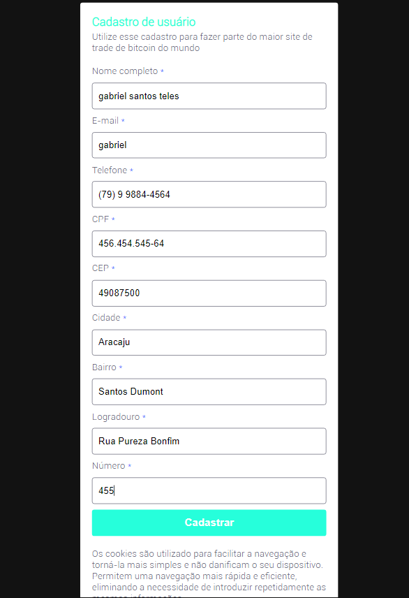

# 💻 | SOBRE APLIACAÇÃO
Desafio feito com reactJS, Projeto usando mascaras de inputs e consumo de api

# 🚀 | Tecnologias
1. REACTJS
1. WEBPACK
1. BABEL
1. AXIOS

# :cowboy_hat_face: | MODO DE USAR
```sh
yarn install
yarn dev
```

# 😱 | RESULTADO


---


# 📝 | Licença
Esse projeto está sob a licença MIT. Veja o arquivo [LICENSE](README.md) para mais detalhes.
